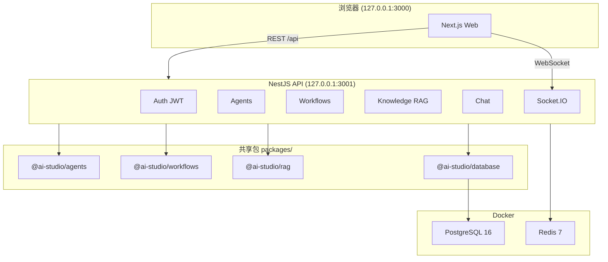

# AI Agent Studio — 项目代码整理

> 工业级 AI 多智能体协同平台（本地版）完整代码结构与核心实现说明  
> 生成日期：2026-05-28 · 源码文件 77 个 TypeScript/TSX · 行业知识库 80 篇 Markdown

---

## 1. 项目概览

| 项目 | 说明 |
|------|------|
| 名称 | AI Agent Studio |
| 类型 | pnpm Monorepo |
| 前端 | Next.js 15 + React 19 + TailwindCSS |
| 后端 | NestJS 10 + Prisma + PostgreSQL + Redis |
| AI | DeepSeek API · RAG · 合同网协议 · 工作流引擎 |
| 运行方式 | Docker + `start.bat` 一键启动 |
| 访问地址 | 前端 `http://127.0.0.1:3000` · API `http://127.0.0.1:3001` |
| 演示账号 | `admin@aistudio.local` / `admin123` |

---

## 2. 系统架构



### 包依赖关系

```
apps/web   → types, utils
apps/api   → agents, workflows, rag, database, types, utils
workflows  → agents, types, utils
agents     → types, utils
rag        → types, utils
database   → utils, @prisma/client
utils      → types
ui         → (独立，暂未接入 web)
```

---

## 3. 目录结构

```
AI Agent Studio/
├── README.md
├── start.bat                    # Windows 一键启动
├── package.json                 # 根脚本
├── pnpm-workspace.yaml
├── tsconfig.base.json
├── docker-compose.yml           # PostgreSQL + Redis
├── .env.example
│
├── docs/                        # 项目文档
│   ├── INSTALL.md
│   ├── USER_GUIDE.md
│   ├── ARCHITECTURE.md
│   ├── API_DOC.md
│   ├── DEV_LOG.md
│   └── PROJECT_CODE.md          # 本文件
│
├── apps/
│   ├── api/                     # NestJS 后端
│   │   └── src/
│   │       ├── main.ts          # 入口
│   │       ├── app.module.ts
│   │       ├── auth/            # JWT 认证
│   │       ├── agents/          # Agent CRUD + 任务分配
│   │       ├── workflows/     # 工作流 CRUD + 执行
│   │       ├── knowledge/       # 知识库 + RAG 检索
│   │       ├── scenarios/       # 工业场景
│   │       ├── dashboard/       # 驾驶舱指标
│   │       ├── tasks/           # 任务管理
│   │       ├── chat/            # Agent 对话
│   │       └── events/          # WebSocket 网关
│   │
│   └── web/                     # Next.js 前端
│       └── src/
│           ├── app/             # App Router 页面
│           ├── components/      # UI 组件
│           ├── lib/api.ts       # API 客户端
│           └── stores/          # Zustand 状态
│
└── packages/
    ├── database/                # Prisma + 种子 + 行业文档入库
    │   ├── prisma/schema.prisma
    │   ├── prisma/seed.ts
    │   ├── knowledge-base/industry/   # 80 篇行业 MD
    │   └── src/
    │       ├── ingest-industry-docs.ts
    │       ├── content-factory.ts
    │       └── industry-doc-generator.ts
    ├── agents/                  # DeepSeek 客户端 + 合同网协议
    ├── workflows/               # LangGraph 风格工作流引擎
    ├── rag/                     # 文档切片 + 向量检索
    ├── types/                   # 共享 TypeScript 类型
    ├── utils/                   # 工具函数 + 简易 embedding
    └── ui/                      # 共享 cn 工具
```

---

## 4. 环境变量

`.env.example` 关键配置：

| 变量 | 说明 |
|------|------|
| `HOST` / `BIND_ADDRESS` | 绑定 `127.0.0.1`，仅本机访问 |
| `DATABASE_URL` | PostgreSQL 连接串 |
| `POSTGRES_PORT` | 默认 5432，`start.bat` 可自动避让 |
| `REDIS_URL` | Docker 内网 Redis |
| `JWT_SECRET` / `JWT_EXPIRES_IN` | JWT 签名 |
| `DEEPSEEK_API_KEY` | DeepSeek API（空则走本地模拟） |
| `API_PORT` | 3001 |
| `NEXT_PUBLIC_API_URL` | 前端请求 API 地址 |
| `NEXT_PUBLIC_WS_URL` | WebSocket 地址 |

---

## 5. 启动与脚本

### 5.1 一键启动 `start.bat`

流程：检测 Node/pnpm/Docker → 复制 `.env` → `pnpm install` → `docker compose up -d` → `db:generate` → `db:push` → `db:seed` → `pnpm dev` → 打开浏览器。

### 5.2 根目录 `package.json` 脚本

| 脚本 | 作用 |
|------|------|
| `pnpm dev` | 并行启动 web + api |
| `pnpm dev:web` | 仅前端 |
| `pnpm dev:api` | 仅后端 |
| `pnpm build` | 构建全部包 |
| `pnpm db:generate` | Prisma generate |
| `pnpm db:push` | 同步数据库 schema |
| `pnpm db:seed` | 写入种子数据 |
| `pnpm db:ingest` | 行业文档入库 |
| `pnpm content:generate` | 重新生成 80 篇行业 MD |
| `pnpm db:studio` | Prisma Studio GUI |

---

## 6. 后端代码

### 6.1 入口 `apps/api/src/main.ts`

```typescript
// 加载 .env → CORS → ValidationPipe → 全局前缀 /api → 监听 127.0.0.1:3001
app.setGlobalPrefix('api', {
  exclude: [
    { path: '', method: RequestMethod.GET },
    { path: 'info', method: RequestMethod.GET },
  ],
});
await app.listen(port, host); // host = 127.0.0.1
```

### 6.2 模块注册 `apps/api/src/app.module.ts`

```typescript
@Module({
  imports: [
    AuthModule,
    AgentsModule,
    WorkflowsModule,
    KnowledgeModule,
    ScenariosModule,
    DashboardModule,
    TasksModule,
    ChatModule,
    EventsModule,
  ],
  controllers: [RootController, HealthController],
})
export class AppModule {}
```

### 6.3 REST API 路由一览

**全局前缀：** `/api`（JWT 保护除 auth 外大部分接口）

| 模块 | 方法 | 路径 | 说明 |
|------|------|------|------|
| Health | GET | `/api/health` | 健康检查 |
| Auth | POST | `/api/auth/register` | 注册 |
| Auth | POST | `/api/auth/login` | 登录 |
| Auth | GET | `/api/auth/profile` | 当前用户 |
| Agents | GET/POST/PUT/DELETE | `/api/agents` | Agent CRUD |
| Agents | POST | `/api/agents/assign-task` | 合同网任务分配 |
| Workflows | GET/POST/PUT/DELETE | `/api/workflows` | 工作流 CRUD |
| Workflows | POST | `/api/workflows/:id/execute` | 执行工作流 |
| Knowledge | GET/POST/DELETE | `/api/knowledge` | 知识库管理 |
| Knowledge | POST | `/api/knowledge/:id/upload` | 上传文档 |
| Knowledge | POST | `/api/knowledge/:id/search` | RAG 检索 |
| Knowledge | POST | `/api/knowledge/:id/organize` | 按 Agent 整理 |
| Scenarios | GET/PUT | `/api/scenarios` | 工业场景 |
| Dashboard | GET | `/api/dashboard/metrics` | 驾驶舱指标 |
| Dashboard | GET | `/api/dashboard/charts` | 图表数据 |
| Tasks | GET/POST/PUT | `/api/tasks` | 任务管理 |
| Chat | POST | `/api/chat` | Agent 对话 |

### 6.4 WebSocket 事件 `events.gateway.ts`

| 事件 | 方向 | 说明 |
|------|------|------|
| `connected` | S→C | 连接确认 |
| `subscribe:agents` | C→S | 订阅 Agent 状态 |
| `subscribe:logs` | C→S | 订阅日志流 |
| `subscribe:workflow` | C→S | 订阅工作流执行 |
| `agent:event` | S→C | Agent 状态变更 |
| `log:new` | S→C | 新日志 |
| `workflow:step` | S→C | 工作流步骤 |

---

## 7. 前端代码

### 7.1 页面路由

| 路由 | 文件 | 功能 |
|------|------|------|
| `/` | `app/page.tsx` | 控制台总览 |
| `/login` | `app/login/page.tsx` | 登录/注册 |
| `/agents` | `app/agents/page.tsx` | Agent 列表 |
| `/agents/[id]` | `app/agents/[id]/page.tsx` | Agent 详情与对话 |
| `/workflows` | `app/workflows/page.tsx` | React Flow 工作流编辑器 |
| `/collaboration` | `app/collaboration/page.tsx` | 多 Agent 协同（合同网） |
| `/knowledge` | `app/knowledge/page.tsx` | 知识库上传/检索 |
| `/scenarios` | `app/scenarios/page.tsx` | 工业场景入口 |
| `/scenarios/uav` | `app/scenarios/uav/page.tsx` | 无人机制造 |
| `/scenarios/smt` | `app/scenarios/smt/page.tsx` | SMT 制造 |
| `/scenarios/ev` | `app/scenarios/ev/page.tsx` | 新能源汽车 |
| `/dashboard` | `app/dashboard/page.tsx` | ECharts 数据驾驶舱 |

### 7.2 API 客户端 `apps/web/src/lib/api.ts`

```typescript
const API_URL = process.env.NEXT_PUBLIC_API_URL || 'http://127.0.0.1:3001';

class ApiClient {
  private async request<T>(path: string, options: RequestInit = {}): Promise<T> {
    const token = this.getToken();
    if (token) headers['Authorization'] = `Bearer ${token}`;
    const res = await fetch(`${API_URL}/api${path}`, { ...options, headers });
    // 401 自动跳转 /login
  }
}
export const api = new ApiClient();
```

### 7.3 主要组件

| 组件 | 路径 | 作用 |
|------|------|------|
| `AppLayout` | `components/layout/app-layout.tsx` | 侧边栏 + 顶栏布局 |
| `Sidebar` | `components/layout/sidebar.tsx` | 导航菜单 |
| `SciFiBackground` | `components/layout/sci-fi-background.tsx` | 科幻背景动效 |
| `GlassCard` | `components/ui/glass-card.tsx` | 玻璃态卡片 |
| `AgentCard` | `components/ui/agent-card.tsx` | Agent 卡片 |
| `LogStream` | `components/ui/log-stream.tsx` | 实时日志流 |
| `app-store` | `stores/app-store.ts` | Zustand 认证状态 |

---

## 8. 共享包核心代码

### 8.1 `@ai-studio/agents` — AI 客户端与合同网

**DeepSeekClient**：调用 DeepSeek Chat Completions API；无 API Key 时返回本地模拟回复。

```typescript
export class DeepSeekClient {
  async chat(messages, options): Promise<{ content: string; tokens: number }> {
    if (!this.apiKey) return this.mockResponse(messages);
    const response = await fetch(`${this.baseUrl}/chat/completions`, { ... });
    // ...
  }
}
```

**ContractNetProtocol**：多 Agent 任务竞标与分配。

- `announceTask()` — 发布任务
- `submitBid()` — Agent 提交竞标
- `assignTask()` — 按评分选最优 Agent

**AgentCollaborationManager**：协调多 Agent 执行链。

### 8.2 `@ai-studio/workflows` — 工作流引擎

**WorkflowEngine**：LangGraph 风格，按 React Flow 节点图顺序执行。

支持节点类型：

| 类型 | 行为 |
|------|------|
| `start` | 入口，注入初始 context |
| `agent` | 调用 DeepSeekClient |
| `rag` | 调用知识库检索注入 context |
| `condition` | 条件分支 |
| `end` | 结束 |

```typescript
async execute(workflow, input, onStep?, options?) {
  // 从 start 节点遍历 edges，逐步 executeNode
  // 支持 ragSearch 回调注入 RAG 结果
}
```

### 8.3 `@ai-studio/rag` — RAG 管道

**DocumentProcessor**：

- `processDocument()` — 文本切片 + 生成 embedding
- `extractText()` — 模拟 PDF/DOCX/Excel 文本提取

**VectorSearchEngine**：

- `addChunks()` / `search()` — 内存向量索引 + 余弦相似度检索

**searchChunks()** — 从数据库持久化切片中检索

### 8.4 `@ai-studio/utils`

| 函数 | 作用 |
|------|------|
| `chunkText()` | 固定窗口文本切片 |
| `simpleEmbedding()` | 简易本地 embedding（128 维） |
| `cosineSimilarity()` | 余弦相似度 |
| `generateId()` | 生成唯一 ID |
| `formatFileSize()` / `formatDateTime()` | 格式化 |

### 8.5 `@ai-studio/types`

共享类型：`ApiResponse`、`Agent`、`WorkflowNode`、`KnowledgeBase`、`ChatMessage`、`DashboardMetrics` 等。

---

## 9. 数据库

### 9.1 Prisma 模型（13 张表）

| 模型 | 表名 | 说明 |
|------|------|------|
| `User` | users | 用户与角色 |
| `Agent` | agents | AI Agent 配置 |
| `Workflow` | workflows | 工作流图 (nodes/edges JSON) |
| `KnowledgeBase` | knowledge_bases | 知识库 |
| `Document` | documents | 文档元数据 |
| `DocumentChunk` | document_chunks | 切片 + embedding |
| `Conversation` | conversations | 对话会话 |
| `Message` | messages | 消息 |
| `Task` | tasks | 任务 |
| `Log` | logs | 运行日志 |
| `ToolCall` | tool_calls | 工具调用记录 |
| `IndustrialScenario` | industrial_scenarios | 工业场景 |
| `ApiMetric` | api_metrics | API 指标 |

### 9.2 主要枚举

- **UserRole**: ADMIN, USER, OPERATOR
- **AgentStatus**: IDLE, THINKING, EXECUTING, WAITING, ERROR, OFFLINE
- **AgentCategory**: PLANNER, DATA_ANALYST, SCHEDULER, DISPATCHER, QUALITY, SIMULATOR, DECISION, CUSTOM
- **ScenarioType**: UAV_MANUFACTURING, SMT_MANUFACTURING, EV_MANUFACTURING

### 9.3 种子数据 `prisma/seed.ts`

| 数据 | 内容 |
|------|------|
| 用户 | admin + operator（密码 admin123） |
| Agent 模板 | 8 种工业角色（计划员、数据员、排程员、调度员、设计师、质量员、仿真员、协同决策员） |
| 工作流 | demo-workflow-001（含 RAG + Agent 节点） |
| 知识库 | industry-kb-main，80 篇行业文档入库 |
| 场景 | UAV / SMT / EV 三个工业场景 |
| 任务 | 3 条示例任务 |

### 9.4 行业知识库

- **目录**: `packages/database/knowledge-base/industry/`
- **数量**: 80 篇 Markdown（doc-001 ~ doc-080）
- **系统 KB ID**: `industry-kb-main`
- **入库脚本**: `src/ingest-industry-docs.ts`
- **生成脚本**: `pnpm content:generate` → `content-factory.ts` + `doc-content-data.ts`

---

## 10. 完整源码文件索引（77 个）

### apps/api/src/

```
main.ts
app.module.ts
root.controller.ts
health.controller.ts
auth/auth.module.ts
auth/auth.controller.ts
auth/auth.service.ts
auth/auth.dto.ts
auth/jwt.strategy.ts
auth/jwt-auth.guard.ts
agents/agents.module.ts
agents/agents.controller.ts
agents/agents.service.ts
workflows/workflows.module.ts
workflows/workflows.controller.ts
workflows/workflows.service.ts
knowledge/knowledge.module.ts
knowledge/knowledge.controller.ts
knowledge/knowledge.service.ts
scenarios/scenarios.module.ts
scenarios/scenarios.controller.ts
scenarios/scenarios.service.ts
dashboard/dashboard.module.ts
dashboard/dashboard.controller.ts
dashboard/dashboard.service.ts
tasks/tasks.module.ts
tasks/tasks.controller.ts
tasks/tasks.service.ts
chat/chat.module.ts
chat/chat.controller.ts
chat/chat.service.ts
events/events.module.ts
events/events.gateway.ts
```

### apps/web/src/

```
app/layout.tsx
app/page.tsx
app/login/page.tsx
app/agents/page.tsx
app/agents/[id]/page.tsx
app/workflows/page.tsx
app/collaboration/page.tsx
app/knowledge/page.tsx
app/scenarios/page.tsx
app/scenarios/uav/page.tsx
app/scenarios/smt/page.tsx
app/scenarios/ev/page.tsx
app/dashboard/page.tsx
components/layout/app-layout.tsx
components/layout/header.tsx
components/layout/sidebar.tsx
components/layout/sci-fi-background.tsx
components/ui/glass-card.tsx
components/ui/agent-card.tsx
components/ui/status-badge.tsx
components/ui/log-stream.tsx
lib/api.ts
lib/utils.ts
stores/app-store.ts
```

### packages/

```
database/prisma/seed.ts
database/src/index.ts
database/src/constants.ts
database/src/industry-catalog.ts
database/src/industry-doc-generator.ts
database/src/doc-content-data.ts
database/src/content-factory.ts
database/src/ingest.ts
database/src/ingest-industry-docs.ts
database/scripts/generate-doc-content.ts
agents/src/index.ts
workflows/src/index.ts
rag/src/index.ts
types/src/index.ts
utils/src/index.ts
ui/src/index.ts
ui/src/utils.ts
```

### 配置文件

```
apps/web/next.config.ts
apps/web/tailwind.config.ts
apps/web/next-env.d.ts
docker-compose.yml
pnpm-workspace.yaml
tsconfig.base.json
.env.example
start.bat
```

---

## 11. 数据流示例

### Agent 对话

```
用户输入 → POST /api/chat → ChatService
  → 读取 Agent systemPrompt
  → DeepSeekClient.chat()
  → 写入 Message + Log
  → 返回回复
```

### 工作流执行

```
前端点击执行 → POST /api/workflows/:id/execute
  → WorkflowsService 加载 nodes/edges
  → WorkflowEngine.execute()
  → 逐步：start → rag → agent → condition → end
  → Socket.IO 推送 workflow:step
  → 返回 executionId + steps
```

### RAG 检索

```
用户提问 → POST /api/knowledge/:id/search
  → KnowledgeService
  → 从 DocumentChunk 表加载 embedding
  → searchChunks() 余弦相似度排序
  → 返回 topK 切片
```

---

## 12. 相关文档

| 文档 | 路径 | 内容 |
|------|------|------|
| 安装教程 | [INSTALL.md](./INSTALL.md) | 环境搭建与排错 |
| 用户指南 | [USER_GUIDE.md](./USER_GUIDE.md) | 功能使用说明 |
| 系统架构 | [ARCHITECTURE.md](./ARCHITECTURE.md) | 架构设计 |
| API 文档 | [API_DOC.md](./API_DOC.md) | 接口详细说明 |
| 开发记录 | [DEV_LOG.md](./DEV_LOG.md) | 开发历程 |

---

## 13. GitHub 仓库

https://github.com/n4vy6p5x6x-dotcom/AI-Agent-Studio

克隆后：

```bat
copy .env.example .env
pnpm install
start.bat
```

---

*本文档由项目源码自动整理，涵盖目录结构、核心模块、API/路由、数据库与文件索引。*
